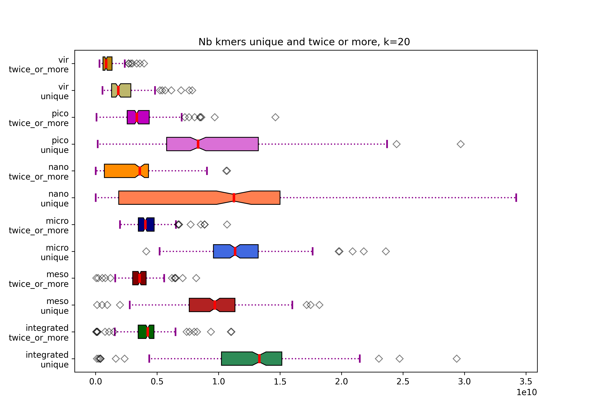
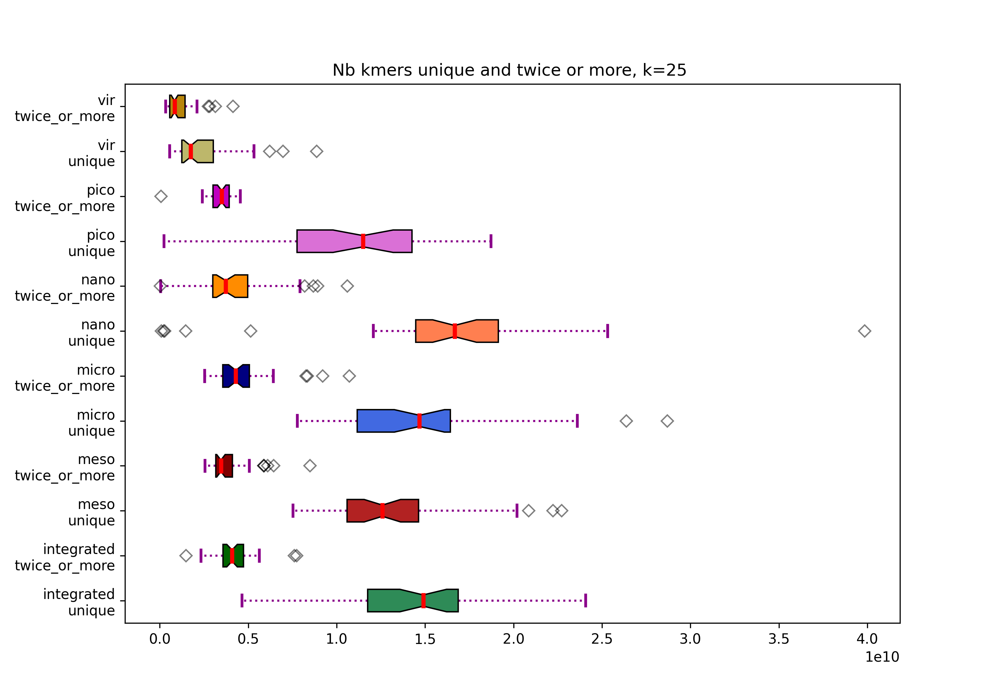

# kmer distribution in Tara data


* Using ntcard: estimation of kmer abundances in tara ocean datasets, using various k values
* Counts are in the `data` directory
* A script for analysing data is provided


 

```bash
python ../../script/analyse_histograms_ntcard.py -h
usage: analyse_histograms_ntcard.py [-h] -p PREFIXES -k K [-c CONSTRAIN] [-o OUTPUT_FILE_NAME]

Analyse the histograms produced by ntCard. It takes the prefix of the histogram files as input and prints & plots the estimated number of distinct kmers occurring more than once.

optional arguments:
  -h, --help           show this help message and exit
  -p PREFIXES          Prefixes of the hist files (separated by a comma). Typically, the prefix is "integrated,meso,micro,nano,pico,vir".
  -d DIRECTORY         Directory of hist files (defaut = "./")
  -k K                 kmer size. Warning: for printing only, no check is made for verifying the file name containing kXX corresponds to this value
  -c CONSTRAIN         [Constrain]: if specified, only the histogram files containing the given sequence are considered. Typically "SUR" for focalizing the anlysis on surface datasets
  -o OUTPUT_FILE_NAME  [Image file name]. If not specified: "tara_estimations_kXX_constrain_XX.png" or "tara_estimations_kXX.png" if no constrain is specified
```

## Analysing k25
```bash
cd experiments/k25

python ../../script/analyse_histograms_ntcard.py -p integrated,meso,micro,nano,pico,vir -d ../../data/k25 -k 25 
k = 25, no constrain

 **integrated**,  nb sets = 37
 unique:
  min: 4659310325
  max: 24066899597
  average: 14544241529
  median: 14894433490
 twice or more:
  min: 1476211732
  max: 7740121002
  average: 4198764150
  median: 4087638764

 **meso**,  nb sets = 38
 unique:
  min: 7524993925
  max: 22719477862
  average: 13195095658
  median: 12926924847
 twice or more:
  min: 2563738489
  max: 8492592219
  average: 3895636572
  median: 3484540163

 **micro**,  nb sets = 34
 unique:
  min: 7776353842
  max: 28682650526
  average: 15017253981
  median: 14731978164
 twice or more:
  min: 2548988776
  max: 10718580093
  average: 4836025530
  median: 4414007422

 **nano**,  nb sets = 35
 unique:
  min: 85080148
  max: 39851953785
  average: 16051818539
  median: 16666417142
 twice or more:
  min: 28436871
  max: 10602978320
  average: 4155540791
  median: 3728493938

 **pico**,  nb sets = 36
 unique:
  min: 239103353
  max: 18726770832
  average: 11074475799
  median: 11910897206
 twice or more:
  min: 79028715
  max: 4558731743
  average: 3453643010
  median: 3522722415

 **vir**,  nb sets = 51
 unique:
  min: 563639250
  max: 8875099331
  average: 2382486937
  median: 1744339888
 twice or more:
  min: 328477051
  max: 4135301124
  average: 1083251793
  median: 838789628
  ```
  
 
 
 
 Same analyze focalizing on the surface samples: 
 ```
 python ../../script/analyse_histograms_ntcard.py -p integrated,meso,micro,nano,pico,vir -d ../../data/k25 -k 25 -c SUR
 ```
 
 
 ## Analysing k20
 ```bash
 python ../../script/analyse_histograms_ntcard.py -p integrated,meso,micro,nano,pico,vir -d ../../data/k20 -k 20       
k = 20, no constrain

 **integrated**,  nb sets = 193
 unique:
  min: 103544626
  max: 29364287933
  average: 12680532844
  median: 13305367235
 twice or more:
  min: 44275392
  max: 11046503851
  average: 4183837741
  median: 4237200538

 **meso**,  nb sets = 208
 unique:
  min: 127803155
  max: 18196555642
  average: 9541808685
  median: 9708536664
 twice or more:
  min: 62047325
  max: 8185743913
  average: 3613447384
  median: 3592009883

 **micro**,  nb sets = 195
 unique:
  min: 4125027664
  max: 23611298727
  average: 11543024194
  median: 11335991504
 twice or more:
  min: 1985486691
  max: 10696322631
  average: 4204002931
  median: 4035506455

 **nano**,  nb sets = 213
 unique:
  min: 18181457
  max: 34207796727
  average: 9822249914
  median: 11244131491
 twice or more:
  min: 7029635
  max: 10687226761
  average: 3125049171
  median: 3590294174

 **pico**,  nb sets = 345
 unique:
  min: 175539780
  max: 29692515841
  average: 9460200765
  median: 8334837902
 twice or more:
  min: 74350154
  max: 14622978993
  average: 3531456265
  median: 3338611295

 **vir**,  nb sets = 159
 unique:
  min: 561238072
  max: 7861237880
  average: 2253100556
  median: 1843524419
 twice or more:
  min: 318911665
  max: 3951703405
  average: 1051416929
  median: 851981303
Saving figure in tara_estimations_k20.png
```